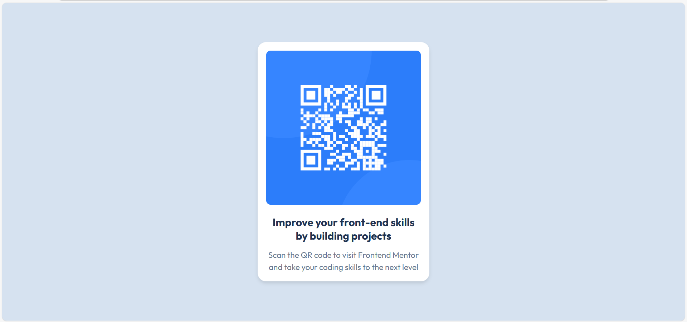

# Frontend Mentor - QR code component solution

This is my solution to the [QR code component challenge on Frontend Mentor](https://www.frontendmentor.io/challenges/qr-code-component-iux_sIO_H). This challenge helped me strengthen my HTML and CSS skills by building a simple, responsive card layout.

---


## 📸 Screenshot




## 🔗 Links

- Solution URL: [https://github.com/7jayasri/qr-code-component](https://github.com/7jayasri/qr-code-component)
- Live Site URL: [https://visionary-elf-ed02a3.netlify.app](https://visionary-elf-ed02a3.netlify.app)

---

## 🔨 My process

### Built with

- Semantic HTML5
- CSS custom properties
- Flexbox
- Mobile-first workflow
- Google Fonts – [Outfit](https://fonts.google.com/specimen/Outfit)

### What I learned

I learned how to:
- Use semantic HTML elements like `<main>`, `<section>`, and `<h1>`
- Center a card layout both vertically and horizontally using Flexbox
- Work with a style guide using HSL colors and spacing consistency
- Apply a mobile-first design approach

Here’s a CSS snippet I'm proud of:

```css
body {
  background-color: hsl(212, 45%, 89%);
  display: flex;
  justify-content: center;
  align-items: center;
  height: 100vh;
  font-family: 'Outfit', sans-serif;
}
## 👤 Author

- GitHub – [@7jayasri](https://github.com/7jayasri)
- Frontend Mentor – [@7jayasri](https://www.frontendmentor.io/profile/7jayasri)
